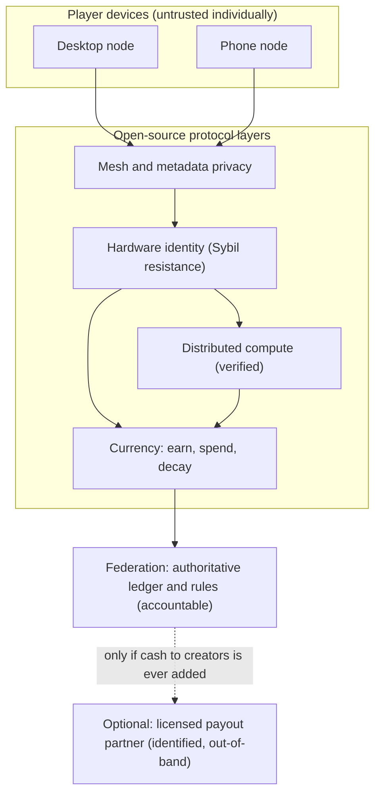

# virtualEconomics: Principles & Architecture

*A design map, not legal advice. Numbers and legal thresholds below should be confirmed with counsel before any build.*

## 1. What we're building

Two layers, deliberately separate.

- **A liberation layer:** a decentralized network for human communication and creative work, free of advertising, behavioral profiling, and corporate intermediation. It runs on players' own devices (desktops and phones), survives censorship and network shutdowns, and can be published open-source and left to run without a controlling company.
- **An internal currency:** a unit earned by participation and contribution, used inside the world. It is **not** redeemable for cash by the operator, it is costly to hoard, and it is hard to move off-platform. That one constraint is what keeps the project out of money-transmission law and keeps the currency from being cornered or laundered.

This supersedes the earlier `virtualEconomics.md` blueprint. The change: that blueprint had a KYC'd cash on-ramp and off-ramp with Chaumian blind-signed coins. We dropped the cash off-ramp entirely (see §8 for why), which removes the bearer-coin laundering vector the red-team found and shrinks the regulated surface to almost nothing.

## 2. Design principles

1. **Money that can't become cash.** The in-world currency has no operator-run redemption to fiat. No cash-out means no money-transmitter status, no AML/KYC gates on spending, and nothing to launder.
2. **Privacy protects people from profiling, not value from the law.** Anonymity lives on the communication and content layers, defeating corporate data harvesting and censorship. It is never engineered to make value transfer undetectable to law enforcement.
3. **One human, one earning rate.** Sybil resistance comes from hardware attestation (ZK-HAM), so a bot farm can't mint a million identities. This protects the economy, not a surveillance file — the proof reveals that a unique device exists, never who owns it.
4. **Issue elastically; punish hoarding.** Currency is minted continuously by participation and decays while idle (demurrage). You cannot corner a supply that keeps expanding and melts in the vault.
5. **Bound transferability.** Earned currency is spendable in-world and hard to move to arbitrary external wallets. This starves any grey-market cash exchange at the source without the operator running one.
6. **The operator surface is as small as possible.** The protocol is open-source and can run without the creator. The smaller the accountable company, the less there is to capture, subpoena, or shut down — and the less the creator risks.
7. **Devices are respected.** Contribution is opt-in, defaults to charging-and-on-WiFi, and never silently drains battery or data. This is also what app-store policy requires.
8. **Verify untrusted work; trust no single device.** Distributed compute results carry cryptographic proof of correct execution. Authoritative state is federated, not left to one player's machine.
9. **No chance-for-cash mechanics.** Nothing that combines randomness with a cash prize — that is gambling law, and we have no cash prize anyway.
10. **Document the non-goals.** The things we deliberately refuse to build (a cash rail, untraceable money, evasion of sanctions or censorship of *value*) are written down (§8) so no future contributor quietly re-adds them.

## 3. The core tensions, and how the design resolves each

- **Player-hosted vs. legally accountable.** Resolved by keeping money non-cashable. A token that never becomes fiat is a game score, not a financial instrument, so "who is accountable for the money" largely stops being a question.
- **Anonymity vs. AML.** Resolved by moving the privacy to communication and content, and removing the cash exit. With no fiat redemption, there is no transmission to monitor.
- **Earned currency vs. backed value.** Resolved by not promising cash value. Earned currency is a consumptive utility, not a claim on a reserve — which also keeps it clear of securities law (no expectation of profit from others' efforts).
- **Phones vs. validator duties.** Resolved by hybrid roles: a small federated set validates the ledger; phones relay, store shards, and run light compute, only when charging on WiFi.
- **Privacy vs. abuse.** Resolved by hardware-attested identity: behavior is unlinkable, but each actor is provably one device, so bots and multi-accounting are bounded.

## 4. Architecture

Who runs what, and what is trusted:

- **Federation (small, named, accountable):** the authoritative ledger and the issuance/demurrage rules. Trusted.
- **Player desktops:** ledger light-validation, shard storage, heavier compute tasks, mesh relay. Untrusted individually; verified in aggregate.
- **Player phones:** mesh relay, shard storage, light compute — opt-in, charging-on-WiFi. Untrusted individually.
- **Open-source protocol:** published so the network can run if the creator steps away.

**Main flows:**

- **Earn (Phase 1):** a device proves it is one unique piece of hardware (ZK-HAM), contributes attention, hosting, or verified compute, and the protocol mints currency to its account under the issuance curve.
- **Spend in-world:** currency buys in-world goods, creator works, and services. Balances decay slowly while idle, so spending beats holding.
- **Player-to-player:** transfers are allowed in-world but bounded (velocity and destination limits) so they can't become an off-platform cash pipe.
- **Contribute compute and get rewarded:** a device runs a sub-task, returns a result with a ZKML proof it ran correctly, the federation records proof-of-useful-work, and reward currency is issued.
- **Cash?** There is no operator cash-out. If paying creators real money is ever wanted, it is done by a **licensed third-party processor**, on identified accounts, as ordinary taxable income — completely separate from the anonymous in-world economy.

## 5. Currency model and monetary policy

- **Single soft currency.** No hard/convertible second token. Nothing to speculate on, nothing to corner.
- **Elastic issuance.** Minted by participation and verified contribution, not capped like Bitcoin. (Bitcoin's fixed cap is a hoarding design; we want the opposite.)
- **Demurrage.** Idle balances decay a small percentage per month, applied per-coin by age. Historically this makes money circulate (Wörgl scrip, 1932; Freicoin) and makes hoarding a losing move.
- **Bounded transferability.** Earned-only, in-world-first, with caps on external movement.
- **Official non-cash sinks.** Premium features, creator tips, hosting priority — attractive places to spend that out-compete any sketchy external exchange (the WoW Token lesson: co-opt the grey market with a sanctioned non-cash channel).
- **No reserve, because no redemption.** Since the operator never owes cash, there is no float to run and no bank-run risk. (If a cash payout partner is ever added, *that* partner holds 1:1 reserves in cash and short-term Treasuries and only its yield funds operations — but that is a separate, licensed entity, not this protocol.)

## 6. Phased rollout

- **Phase 1 — Earn-only, in-world.** Launch the liberation layer and the currency as a pure in-game unit. Components: mesh transport, hardware identity, distributed compute, ledger with issuance and demurrage. Legal posture: a game with a score system; no money transmission, no reserve. **Gate to next phase:** stable economy, Sybil resistance holding, demurrage tuned so the currency circulates rather than inflates or deflates sharply.
- **Phase 2 — Richer internal economy.** Creator marketplaces, services, and the official non-cash sinks. Still no cash. Legal posture: unchanged. **Gate:** healthy creator earnings *in-world*, no significant grey-market cash exchange forming (monitor for it).
- **No Phase 3 cash redemption in this design.** If, later, creators demand real-money payout, it is added only as an **identified, licensed, out-of-band** payout through a regulated partner (the Roblox DevEx / Tilia model) — never as an anonymous cash-out of the in-world currency. That decision is yours and is flagged in §11.

## 7. The shared computing network

- **Desktops:** heavier compute tasks, more shard storage, ledger light-validation, persistent relay.
- **Phones:** light compute, small shard storage, opportunistic mesh relay — opt-in, only while charging on WiFi, respecting OS background limits.
- **Verification:** every result carries a proof of correct execution (ZKML / verifiable computation); redundant execution and spot-checks catch fakers; reward only on verified work. This defeats the "fake-work" farming that hit volunteer-compute and device-reward networks.
- **Device respect:** explicit opt-in, charge-and-WiFi default, hard thermal/battery/data budgets, clear disclosure.
- **Store policy:** the known constraints are Apple's limits on in-app currency, crypto, and unrelated background processing, and Google Play's limits on on-device mining and real-money mechanics. A non-cash currency and opt-in, charge-only compute are the safer side of these lines; confirm current guideline text before submission, and keep the open web / PWA path as a fallback.

## 8. Boundaries — what this design deliberately does not do, and why

| Non-goal | Why it's out |
|---|---|
| Operator cash on/off ramp | Makes you a money transmitter (18 U.S.C. §1960, state MSB, BSA). The red-team showed blind-signed coins become a bearer currency sellable for USDT, and chargeback windows break any backing. |
| Untraceable-to-law-enforcement money movement | That is the laundering/sanctions-evasion vector regardless of intent; historically captured by fraud and ransomware, not by the people the mission wants to free. |
| Barter "bypass" as an anonymity-for-value scheme | Direct barter is legal and taxable, but engineering it to be "resistant to external tracking" for value transfer re-creates the same problem. |
| Serving sanctioned jurisdictions / black markets | Sanctions evasion is strict-liability (IEEPA); the beneficiaries at scale are regimes and brokers, not the vulnerable. Legal humanitarian channels exist (OFAC general licenses) for that goal. |
| Chance-for-cash mechanics | Gambling law. Avoided entirely by having no cash prize. |

## 9. Threat model

| Threat | Example | Control |
|---|---|---|
| Bot / phone farm minting rewards | Emulators spin up thousands of fake earners | Hardware attestation (ZK-HAM): one device, one earning identity |
| Fake compute for rewards | Node returns garbage, claims the reward | ZKML proof of correct execution; redundant checks; reward only on verified work |
| Hoarding / cornering by a whale | Corp buys and sits on supply to pump the rate | Elastic issuance + demurrage: supply expands, hoard decays, price pinned to effort-to-earn |
| Grey-market cash exchange forms anyway | Third party runs an unofficial swap | Bounded transferability + attractive non-cash sinks; monitor and don't feed it (no price API, no cash-out) |
| Malicious node / eclipse / 51% on a player ledger | Bad actors control many devices | Keep authoritative consensus federated; players relay/store, don't finalize money |
| Key/device loss | Phone stolen, account lost | Social or federated recovery for the account; never store large bearer balances on-device |
| Untrusted workloads harm devices | Malware or illegal content via distributed compute | Sandboxed, signed, opt-in workloads only; content policy and takedown at the federation layer |
| Insider at the operator | Rogue admin alters issuance | Multi-party control of issuance keys; public, auditable ledger rules |

## 10. Precedents

| System | What happened | Lesson for us |
|---|---|---|
| Bitcoin | Fixed 21M cap → designed to be hoarded and to appreciate | Do the opposite: elastic + demurrage for circulation |
| Roblox (Robux / DevEx) | Earned-only, gated, KYC'd one-way payout; most Robux can't become cash | Control transferability to starve the grey market; if cash is ever added, do it this way |
| RuneScape / WoW Token | Grey gold market formed; Blizzard co-opted it with an official non-cash token (buys game time) | You can neutralize the grey market with a sanctioned non-cash sink |
| Second Life (Linden / Tilia) | Cash-out required a licensed money-transmitter subsidiary | Cash-out is heavy; avoid it or outsource to a licensed partner |
| Axie Infinity (SLP / Ronin) | Token designed to be farmed and cashed out → hyperinflation and a bridge hack | Farmable cash-out tokens collapse; don't build one |
| Valve (CS:GO keys, 2019) | Purchasable, tradable keys became a fraud currency; Valve made them untradable | Transferable purchased items become laundering rails |
| Liberty Reserve / e-gold | "Unstoppable" cash systems → operators prosecuted | A money system designed to evade the state gets stopped and its operators charged |

## 11. Decisions for you

1. **Cash to creators, ever?** Options: (a) never — stay fully non-cash *(recommended for lowest risk and truest to the mission)*; (b) later, via a licensed partner, identified and taxed. Not an option: an anonymous operator cash-out.
2. **How aggressive is demurrage?** A higher decay rate circulates harder but annoys savers. Recommend starting low (≈1–2%/month) and tuning.
3. **Federation membership.** Who runs the authoritative validators — you alone at first, then a widening trusted set? Recommend starting small and publishing a path to decentralize.
4. **Walk-away plan.** How far do you actually step back, Satoshi-style? Recommend: publish the protocol open-source and minimize the company to the smallest accountable core (or none, if truly non-cash).
5. **Store vs. open web.** Ship in the app stores (accept their policy limits) or lead with a PWA/open-web client? Recommend both, open web as the censorship-resistant fallback.

## 12. Sources

These are the well-established references behind the claims above; the deeper research pass (regulatory status, exact thresholds, current app-store guideline text) should be re-run and cited before any build, as it did not fully complete.

- FinCEN 2019 CVC guidance; Bank Secrecy Act; 18 U.S.C. §1960 (unlicensed money transmission); 31 U.S.C. §5324 (structuring); IEEPA (sanctions).
- Roblox Developer Exchange terms; Second Life / Tilia money-transmitter structure; Blizzard WoW Token; Valve CS:GO key trade restriction (2019); Axie Infinity / Ronin bridge incident.
- Demurrage: Gesell's stamp scrip, Wörgl (1932), Freicoin.
- Privacy/anti-profiling engineering: Tor, mixnets (Loopix), delay-tolerant mesh (Briar).
- Verifiable computation / ZKML for proof-of-useful-work.
