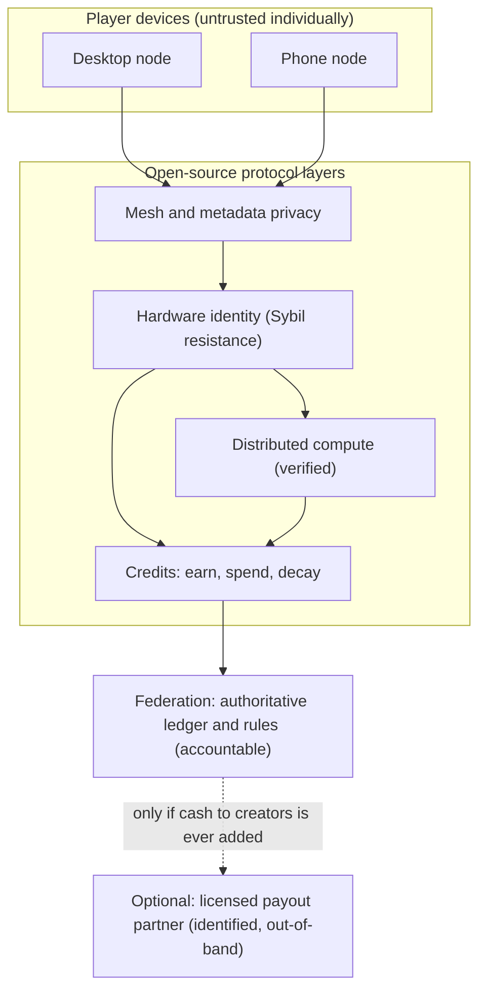

# virtualEconomics: Principles & Architecture

*Status: **brainstorming**. A design map, not legal advice. Numbers and legal thresholds below should be confirmed with counsel before any build.*

> **How to read this doc:** blockquote notes like this one flag feasibility concerns, open questions, and design branch points, so a reader gets the real scope instead of only the optimistic version. Nothing here is committed engineering.

## 1. What we're building

**Big picture:** a secure, private, global **distributed computing network** that runs on ordinary people's devices — desktops and phones. It has three faces: shared compute, private communication and content, and an internal credit economy that pays people for keeping their device available to the network. No advertising surveillance, no behavioral profiling, and the protocol can be published open-source and left to run.

A design goal worth stating plainly: **at scale, individual handsets become fungible.** The network pools capacity and hands out small sub-tasks, so no single device's contribution is distinguishable from another's — the differences between a flagship phone and an old one wash out in the aggregate, and the network presents a roughly uniform virtual compute resource.

> **Feasibility note:** "every handset has the same processing power" is a claim about the *pool*, not each device. Heterogeneity still matters for scheduling (latency, RAM ceilings, radio availability), so the scheduler has to *hide* it, not eliminate it. Realistic version: weaker devices get smaller or fewer sub-tasks and earn proportionally; the pool looks uniform, individual nodes do not.

The system has two deliberately separate layers:

- **A liberation / compute layer:** decentralized communication, content, and compute, free of ads and profiling, that survives censorship and network shutdowns and can run without a controlling company.
- **An internal currency ("credits"):** earned by participation and contribution, used inside the world. It is **not** redeemable for cash by the operator, is costly to hoard, and is hard to move off-platform. That one constraint keeps the project out of money-transmission law and keeps the currency from being cornered or laundered.

This supersedes the earlier `virtualEconomics.md` blueprint, which had a KYC'd fiat on-ramp and cash off-ramp with Chaumian blind-signed coins. We dropped the cash off-ramp entirely (see §8 for why), which removes the bearer-coin laundering vector the red-team found and shrinks the regulated surface to almost nothing.

## 2. Design principles

1. **Money that can't become cash.** Credits have no operator-run redemption to fiat. No cash-out means no money-transmitter status, no AML/KYC gates on spending, and nothing to launder.
2. **Privacy protects people from profiling, not value from the law.** Anonymity lives on the communication and content layers, defeating corporate data harvesting and censorship. It is never engineered to make value transfer undetectable to law enforcement.
   > **Feasibility note:** pure privacy is bounded by hardware and OS trust — the Secure Enclave, the baseband, and what Apple/Google expose to apps set the ceiling. Some current gaps can be exploited short-term, but they are vendor-dependent and close over time, so the design must not *rely* on them. Treat strong privacy as "best achievable on commodity hardware," not absolute.
3. **One human, one earning rate.** Sybil resistance comes from hardware attestation (ZK-HAM), so a bot farm can't mint a million identities. The proof reveals that a unique device exists, never who owns it.
4. **Issue elastically; punish hoarding.** Credits are minted continuously by participation and decay while idle (demurrage). You cannot corner a supply that keeps expanding and melts in the vault.
5. **Bound transferability.** Credits are spendable in-world and hard to move to arbitrary external wallets, which starves any grey-market cash exchange at the source.
6. **The operator surface is as small as possible.** The protocol is open-source and can run without the creator. The smaller the accountable company, the less there is to capture, subpoena, or shut down — and the less the creator risks.
7. **Devices are respected.** Contribution is opt-in, defaults to charging-and-on-WiFi, and never silently drains battery or data. This is also what app-store policy requires.
8. **Verify untrusted work; trust no single device.** Distributed compute results carry proof of correct execution. Authoritative state is federated, not left to one player's machine.
9. **No chance-for-cash mechanics.** Nothing that pairs randomness with a cash prize — that is gambling law, and we have no cash prize anyway.
10. **Document the non-goals.** The things we deliberately refuse to build (§8) are written down so no future contributor quietly re-adds them.

## 3. The core tensions, and how the design resolves each

- **Player-hosted vs. legally accountable.** Resolved by keeping credits non-cashable. A token that never becomes fiat is a game score, not a financial instrument.
- **Anonymity vs. AML.** Resolved by putting privacy on communication/content and removing the cash exit. No fiat redemption, no transmission to monitor.
- **Earned currency vs. backed value.** Resolved by not promising cash value. Credits are consumptive utility, not a claim on a reserve — which also keeps them clear of securities law.
- **Phones vs. validator duties.** Resolved by hybrid roles: a small federated set validates the ledger; phones relay, store shards, and run light compute, only when charging on WiFi.
- **Privacy vs. abuse.** Resolved by hardware-attested identity: behavior is unlinkable, but each actor is provably one device.

## 4. Architecture

Who runs what, and what is trusted:

- **Federation (small, named, accountable):** the authoritative ledger and the issuance/demurrage rules. Trusted.
- **Player desktops:** ledger light-validation, shard storage, heavier compute, mesh relay. Untrusted individually; verified in aggregate.
- **Player phones:** mesh relay, shard storage, light compute — opt-in, charging-on-WiFi. Untrusted individually.
- **Open-source protocol:** published so the network can run if the creator steps away.



**Layer-by-layer, with scope notes (mapped from the protocol spec):**

- **Transport / mesh (DTN).** Delay-tolerant, device-to-device routing (BLE, Wi-Fi Direct, UWB) with store-carry-forward, falling back to the internet wrapped in ordinary TLS. Purpose here: censorship-resistant *communication*, not untraceable money.
  > **Feasibility note:** the spec's "global microsecond-synchronized transmissions" to defeat RF fingerprinting is extremely hard — arguably infeasible — across heterogeneous consumer radios. The anonymity claims ("obliterates fingerprinting," "blinds TDOA") overstate what a mesh of commodity phones can deliver. Realistic target: metadata mixing and cover traffic at the *packet* layer (Tor/Loopix-style), not physical-layer untraceability.
- **Identity (ZK-HAM).** Hardware-rooted attestation via the Secure Enclave, proving a node is one unique device without revealing who owns it. This is the Sybil-resistance backbone and the right idea.
  > **Feasibility note:** binding to IMEI/chip IDs has concrete limits — what Apple's DeviceCheck/App Attest and Android's Play Integrity/Keystore actually expose, enclave availability across the device range, and revocation/rotation. Design to those real APIs, not to raw serials.
- **Privacy (cover traffic / mixing).** Metadata minimization so behavior can't be profiled. Legitimate, lawful privacy engineering. (See the §2.2 hardware-ceiling note.)
- **Compute (DAM-MoE).** Task decomposition into small sub-tasks routed to devices whose profile fits, results reassembled client-side.
  > **Feasibility note:** "500M–3B models fit in RAM, run instantly, zero lag" is plausible on newer hardware but optimistic on old phones and over a lossy mesh. See §7 for the verification caveat.
- **Credits ledger.** Issuance, demurrage, and accounting — the authoritative part, kept federated.

**Main flows:** earn (prove unique device → contribute → credits minted) · spend in-world · bounded player-to-player · contribute verified compute for reward · **no operator cash-out** (if paying creators real money is ever wanted, a licensed third-party processor does it on identified accounts, separate from the anonymous economy).

## 5. Currency model and monetary policy

- **Single soft currency ("credits").** No hard/convertible second token. Nothing to speculate on, nothing to corner.
- **Backed by the network itself.** The same blockchain that admits a device to participate (ZK-HAM) issues and accounts for credits. Their value is the digital goods and entertainment they buy inside the world — not a fiat claim.
- **Elastic issuance.** Minted by participation and verified contribution, not capped like Bitcoin (a fixed cap is a hoarding design; we want the opposite).
- **Earned slowly by availability.** A device that stays powered on and reachable earns a baseline credit drip, on top of rewards for verified compute and active contribution. Being present *is* the lightest form of participation.
  > **Open question:** a pure "paid to be powered on" drip invites idle-farming (racks of phones doing nothing). Tie the baseline to *reachable + occasionally useful* (served a relay, held a shard, passed a liveness+attestation check), not to mere uptime, or the drip becomes a battery-burning faucet.
- **Demurrage.** Idle balances decay a small percentage per month, applied per-coin by age. Historically makes money circulate (Wörgl scrip, 1932; Freicoin) and makes hoarding a losing move.
- **Bounded transferability.** Earned-only, in-world-first, caps on external movement.
- **Official non-cash sinks.** Premium features, creator tips, hosting priority — attractive places to spend that out-compete any sketchy external exchange (the WoW Token lesson).
- **No reserve, because no redemption.** The operator never owes cash, so there is no float and no bank-run risk.

### 5a. If advertising is ever allowed: pay the viewer, not the platform

The inversion at the heart of the mission: advertiser money goes **to the person watching the ad**, not to a platform harvesting their attention. If ads exist at all, this is how they should work.

> **Branch point (brainstorming):** "the money goes directly to the viewer" has two forms with very different legal weight:
> - **Closed-loop (recommended):** advertiser pays cash to the network; the viewer receives *credits* (non-cash). The benefit stays inside the world, so it's still closed-loop and low-burden. Close to how Brave's Basic Attention Token (BAT) rewards work.
> - **Cash to the viewer:** routing advertiser cash out to viewers as money is a payout rail — taxable income to the viewer (1099-style reporting) and it reintroduces the money-movement questions we deliberately removed. If ad-earned credits can then be cashed out, credits become a cash instrument.
>
> Also: paying people to view ads invites view-farming — the same Sybil problem, solved the same way (hardware attestation + proof-of-genuine-view).

Precedent to study: **Brave / BAT** — advertisers pay, users earn a share for attention, value is spent in-ecosystem. Exactly this mechanic, already battle-tested for the legal edges.

## 6. Phased rollout

- **Phase 1 — Earn-only, in-world.** Launch the liberation/compute layer and credits as a pure in-game unit. Components: mesh transport, hardware identity, distributed compute, ledger with issuance + demurrage. Legal posture: a game with a score system; no money transmission, no reserve. **Gate:** stable economy, Sybil resistance holding, demurrage tuned so credits circulate.
- **Phase 2 — Richer internal economy.** Creator marketplaces, services, official non-cash sinks, optionally the pay-the-viewer ad model in closed-loop form. Still no cash. **Gate:** healthy in-world creator earnings, no significant grey-market cash exchange forming (monitor for it).
- **No Phase 3 cash redemption in this design.** If creators later demand real-money payout, it is added only as an **identified, licensed, out-of-band** payout through a regulated partner (the Roblox DevEx / Tilia model) — never as an anonymous cash-out of credits. Your call; flagged in §11.

## 7. The shared computing network

- **Desktops:** heavier compute, more shard storage, ledger light-validation, persistent relay.
- **Phones:** light compute, small shard storage, opportunistic relay — opt-in, charging-on-WiFi, respecting OS background limits.
- **Verification:** reward only on *verified* work, or farmers will submit garbage.
  > **Feasibility note:** the spec's "ZKML proof on every task" is the gold standard but currently very expensive — generating a zero-knowledge proof of an ML computation can cost orders of magnitude more than the computation itself. Near-term, lean on cheaper schemes — redundant execution across independent nodes, random spot-checks, trusted-execution attestation, reputation — and reserve ZK proofs for high-value or disputed results.
- **Device respect:** explicit opt-in, charge-and-WiFi default, hard thermal/battery/data budgets, clear disclosure.
- **Store policy:** Apple limits in-app currency, crypto, and unrelated background processing; Google Play limits on-device mining and real-money mechanics. A non-cash currency and opt-in, charge-only compute sit on the safer side; confirm current guideline text before submission and keep the open-web/PWA path as a fallback.

## 8. Boundaries — what this design deliberately does not do, and why

| Non-goal | Why it's out |
|---|---|
| Operator cash on/off ramp | Makes you a money transmitter (18 U.S.C. §1960, state MSB, BSA). The red-team showed blind-signed coins become a bearer currency sellable for USDT, and chargeback windows break any backing. |
| Untraceable-to-law-enforcement money movement | The laundering/sanctions-evasion vector regardless of intent; historically captured by fraud and ransomware, not by the people the mission wants to free. |
| Barter "bypass" as an anonymity-for-value scheme | Direct barter is legal and taxable, but engineering it to be "resistant to external tracking" for value re-creates the same problem. |
| Serving sanctioned jurisdictions / black markets | Sanctions evasion is strict-liability (IEEPA); legal humanitarian channels (OFAC general licenses) exist for that goal. |
| Chance-for-cash mechanics | Gambling law. Avoided by having no cash prize. |

## 9. Threat model

| Threat | Example | Control |
|---|---|---|
| Bot / phone farm minting rewards | Emulators spin up thousands of fake earners | Hardware attestation (ZK-HAM): one device, one earning identity |
| Idle-farming the availability drip | Racks of phones powered on, doing nothing | Tie baseline reward to reachable + occasionally useful, not uptime |
| Fake compute for rewards | Node returns garbage, claims the reward | Redundant execution + spot-checks + attestation; ZK proof for high-value work |
| Ad view-farming | Bots "watch" ads for payout | Attestation + proof-of-genuine-view; closed-loop credits, not cash |
| Hoarding / cornering by a whale | Corp buys and sits on supply to pump the rate | Elastic issuance + demurrage: supply expands, hoard decays |
| Grey-market cash exchange forms anyway | Third party runs an unofficial swap | Bounded transferability + attractive non-cash sinks; don't feed it |
| Malicious node / eclipse / 51% | Bad actors control many devices | Keep authoritative consensus federated; players relay/store, don't finalize money |
| Key / device loss | Phone stolen, account lost | Social or federated recovery; never store large bearer balances on-device |
| Untrusted workloads harm devices | Malware or illegal content via distributed compute | Sandboxed, signed, opt-in workloads; content policy + takedown at the federation |
| Insider at the operator | Rogue admin alters issuance | Multi-party control of issuance keys; public, auditable ledger rules |

## 10. Precedents

| System | What happened | Lesson for us |
|---|---|---|
| Bitcoin | Fixed 21M cap → designed to be hoarded | Do the opposite: elastic + demurrage for circulation |
| Roblox (Robux / DevEx) | Earned-only, gated, KYC'd one-way payout | Control transferability; if cash is ever added, do it this way |
| RuneScape / WoW Token | Grey gold market → Blizzard co-opted it with an official non-cash token | Neutralize the grey market with a sanctioned non-cash sink |
| Second Life (Linden / Tilia) | Cash-out required a licensed money-transmitter subsidiary | Cash-out is heavy; avoid it or outsource to a licensed partner |
| Axie Infinity (SLP / Ronin) | Farmable cash-out token → hyperinflation + bridge hack | Farmable cash-out tokens collapse; don't build one |
| Valve (CS:GO keys, 2019) | Purchasable, tradable keys became a fraud currency → made untradable | Transferable purchased items become laundering rails |
| Brave / BAT | Advertisers pay, users earn attention rewards spent in-ecosystem | The model for pay-the-viewer ads; study its legal edges |
| Liberty Reserve / e-gold | "Unstoppable" cash systems → operators prosecuted | A money system built to evade the state gets stopped |

## 11. Decisions for you

1. **Cash to creators, ever?** (a) never — stay fully non-cash *(recommended)*; (b) later, via a licensed partner, identified and taxed. Not an option: an anonymous operator cash-out.
2. **Ad model, if any?** Closed-loop credits to viewers *(recommended)* vs. cash to viewers (payout rail, taxable). Or no ads at all.
3. **Demurrage rate.** Start low (≈1–2%/month) and tune.
4. **Availability drip.** What counts as "contributing" for the baseline reward — reachable-and-useful, not mere uptime.
5. **Federation membership.** Who runs the authoritative validators, and the path to widen the set.
6. **Walk-away plan.** How far you step back, Satoshi-style — publish open-source, minimize the accountable core.
7. **Store vs. open web.** Ship in app stores (accept policy limits) or lead with a PWA? Recommend both, open web as the censorship-resistant fallback.

## 12. Sources

Well-established references behind the claims above; the deeper research pass (regulatory status, exact thresholds, current app-store guideline text) should be re-run and cited before any build, as it did not fully complete.

- FinCEN 2019 CVC guidance; Bank Secrecy Act; 18 U.S.C. §1960; 31 U.S.C. §5324 (structuring); IEEPA (sanctions).
- Roblox Developer Exchange; Second Life / Tilia; Blizzard WoW Token; Valve CS:GO key restriction (2019); Axie Infinity / Ronin; Brave / Basic Attention Token.
- Demurrage: Gesell's stamp scrip, Wörgl (1932), Freicoin.
- Privacy/anti-profiling: Tor, mixnets (Loopix), delay-tolerant mesh (Briar).
- Device attestation: Apple App Attest / DeviceCheck, Android Play Integrity / Keystore.
- Verifiable computation / ZKML; trusted-execution attestation.
```
